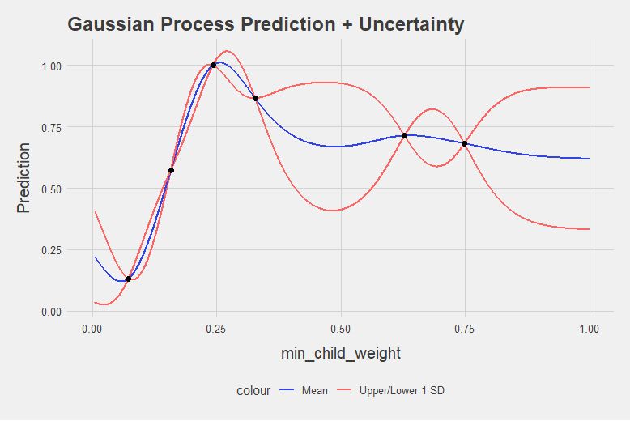

<!-- README.md is generated from README.Rmd. Please edit that file -->
Linux/Mac: \[\] (<https://travis-ci.org/AnotherSamWilson/ParBayesianOptimization/>)

ParBayesianOptimization
=======================

Installation
------------

You can install ParBayesianOptimization from github with:

``` r
# install.packages("devtools")
devtools::install_github("AnotherSamWilson/ParBayesianOptimization")
```

Package Process
---------------

Machine learning projects will commonly require a user to "tune" a model's hyperparameters to find a good balance between bias and variance. Several tools are available in a data scientist's toolbox to handle this task, the most blunt of which is a grid search. A grid search gauges the model performance over a pre-defined set of hyperparameters without regard for past performance. As models increase in complexity and training time, grid searches become unwieldly.

Idealy, we would use the information from prior model evaluations to guide us in our future parameter searches. This is precisely the idea behind Bayesian Optimization, in which our prior response distribution is iteratively updated based on our best guess of where the best parameters are. The `ParBayesianOptimization` package does exactly this in the following process:

1.  Initial parameter-score pairs are found
2.  Gaussian Process is fit/updated
3.  Numerical methods are used to estimate the best parameter set
4.  New parameter-score pairs are found
5.  Repeat steps 2-4 until some stopping criteria is met

Bayesian Optimization Intuition
-------------------------------

As an example, let's say we are only tuning 1 hyperparameter in an xgboost model, min\_child weight within the bounds \[0,1\]. We have initialized the process by randomly sampling the scoring function 6 times, and get the following results:

|  min\_child\_weight|      Score|
|-------------------:|----------:|
|           0.6280082|  0.7133457|
|           0.3276477|  0.8655448|
|           0.7486012|  0.6814730|
|           0.2425469|  1.0000000|
|           0.0724098|  0.1308284|
|           0.1579683|  0.5733343|

How do we go about determining the best min\_child\_weight to try next? As it turns out, Gaussian processes can give us a very good definition for our prior distribution. Fitting a Gaussian process to the data above (indexed by min\_child\_weight), we can see the expected value accross our parameter bounds, as well as the uncertainty at different points:



Before we can select our next candidate parameter to run the scoring function on, we need to determine how we define a "good" parameter inside this prior distribution. This is done by maximizing different functions within the Gaussian process. There are several functions to choose from:

-   Upper Confidence Bound (ucb)
-   Probability Of Improvement (poi)
-   Expected Improvement (ei)
-   Expected Improvement Per Second (eips)

Continuing the example, we select to find the min\_child\_weight which maximizes the expected improvement according to the Gaussian process. As you can see, there are several good candidates:


An advanced feature of ParBayesianOptimization, which you can read about in the vignette advancedFeatures, describes how to use the `minClusterUtility` parameter to search over the different local maximums shown above. If not specified, only the global maximum would be sampled.

Practical Example
-----------------

In this example, we will be using the agaricus.train dataset provided in the XGBoost package. Here, we load the packages, data, and create a folds object to be used in the scoring function.

``` r
library("xgboost")
library("ParBayesianOptimization")

data(agaricus.train, package = "xgboost")

Folds <- list(Fold1 = as.integer(seq(1,nrow(agaricus.train$data),by = 3))
            , Fold2 = as.integer(seq(2,nrow(agaricus.train$data),by = 3))
            , Fold3 = as.integer(seq(3,nrow(agaricus.train$data),by = 3)))
```

Now we need to define the scoring function. This function should, at a minimum, return a list with a `Score` element, which is the model evaluation metric we want to maximize. We can also retain other pieces of information created by the scoring function by including them as named elements of the returned list. In this case, we want to retain the optimal number of rounds determined by the `xgb.cv`:

``` r
scoringFunction <- function(max_depth, min_child_weight, subsample) {

  dtrain <- xgb.DMatrix(agaricus.train$data,label = agaricus.train$label)
  
  Pars <- list( booster = "gbtree"
              , eta = 0.01
              , max_depth = max_depth
              , min_child_weight = min_child_weight
              , subsample = subsample
              , objective = "binary:logistic"
              , eval_metric = "auc")

  xgbcv <- xgb.cv(params = Pars
                , data = dtrain
                , nround = 100
                , folds = Folds
                , prediction = TRUE
                , showsd = TRUE
                , early_stopping_rounds = 5
                , maximize = TRUE
                , verbose = 0)

  return(list(Score = max(xgbcv$evaluation_log$test_auc_mean)
             , nrounds = xgbcv$best_iteration
             )
         )
}
```

Some other objects we need to define are the bounds, GP kernel and acquisition function.

-   The `bounds` will tell our process its search space.
-   The kernel is passed to the `GauPro` function `GauPro_kernel_model` and defines the covariance function.
-   The acquisition function defines the utility we get from using a certain parameter set.

``` r
bounds <- list( max_depth = c(2L, 10L)
              , min_child_weight = c(1L, 100L)
              , subsample = c(0.25, 1))

kern <- "Matern52"

acq <- "ei"
```

We are now ready to put this all into the `BayesianOptimization` function.

``` r
ScoreResult <- BayesianOptimization(FUN = scoringFunction
                                  , bounds = bounds
                                  , initPoints = 10
                                  , bulkNew = 1
                                  , nIters = 12
                                  , kern = kern
                                  , acq = acq
                                  , kappa = 2.576
                                  , verbose = 1
                                  , parallel = FALSE)
#> 
#> Running initial scoring function 10 times in 1 thread(s).
#> 
#> Starting round number 1
#>   1) Fitting Gaussian process...
#>   2) Running local optimum search...
#>   3) Running scoring function 1 times in 1 thread(s)...
#> 
#> Starting round number 2
#>   1) Fitting Gaussian process...
#>   2) Running local optimum search...
#>   3) Running scoring function 1 times in 1 thread(s)...
```

The console informs us that the process initialized by running `scoringFunction` 10 times. It then fit a Gaussian process to the parameter-score pairs, found the global optimum of the acquisition function, and ran `scoringFunction` again. This process continued until we had 12 parameter-score pairs. You can interrogate the `ScoreResult` object to see the results:

``` r
ScoreResult$ScoreDT
#>     Iteration max_depth min_child_weight subsample Elapsed     Score nrounds
#>  1:         0        10               18 0.7882644    1.27 0.9986003      37
#>  2:         0         3               67 0.8582202    0.34 0.9846677       6
#>  3:         0         7               86 0.7967788    0.18 0.9779723       1
#>  4:         0         6                9 0.7329761    0.48 0.9984480       6
#>  5:         0         3               99 0.7115102    0.21 0.9782927       2
#>  6:         0         6               21 0.6472898    0.82 0.9971340      18
#>  7:         0        10               26 0.7480464    0.36 0.9945603       5
#>  8:         0        10               73 0.7836358    0.18 0.9779723       1
#>  9:         0         8               96 0.5279121    0.44 0.9768317      13
#> 10:         0         2                6 0.7806679    0.48 0.9906920      18
#> 11:         1         9                1 0.6982218    0.30 0.9984757       1
#> 12:         2         9                1 0.8002098    0.23 0.9984757       2
```

``` r
ScoreResult$BestPars
#>    Iteration max_depth min_child_weight subsample     Score nrounds elapsedSecs
#> 1:         0        10               18 0.7882644 0.9986003      37      6 secs
#> 2:         1        10               18 0.7882644 0.9986003      37     14 secs
#> 3:         2        10               18 0.7882644 0.9986003      37     21 secs
```
