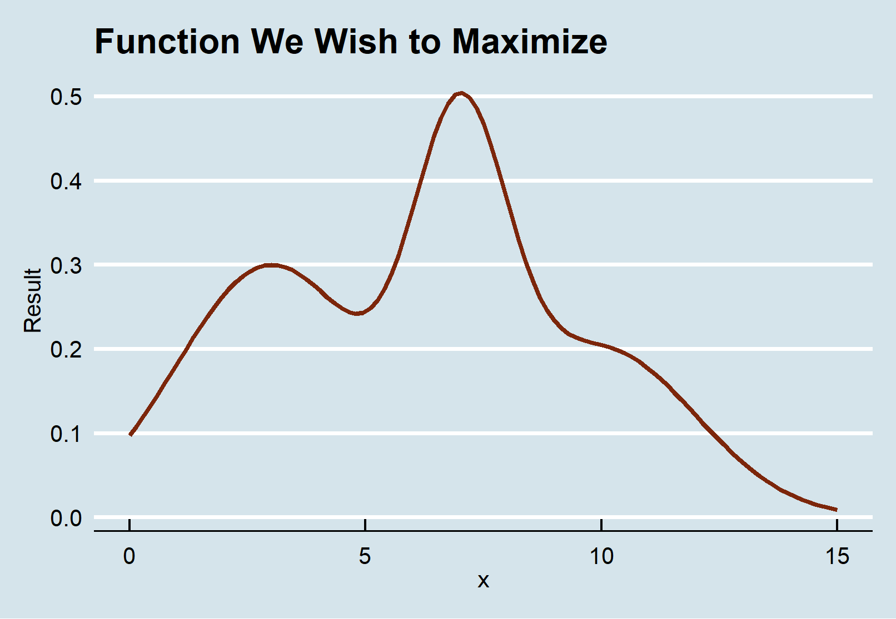
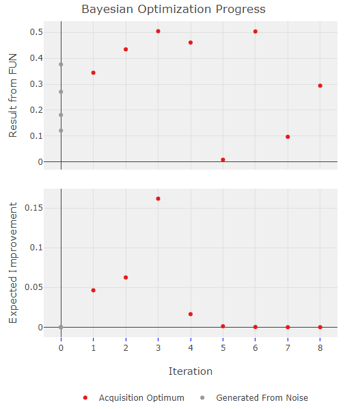

<!-- README.md is generated from README.Rmd. Please edit that file -->

[](https://travis-ci.org/AnotherSamWilson/ParBayesianOptimization)
[](https://CRAN.R-project.org/package=ParBayesianOptimization)
[](https://CRAN.R-project.org/package=ParBayesianOptimization)

# Parallel Bayesian Optimization

## Table of Contents

This README contains a thorough walkthrough of Bayesian optimization and
the syntax needed to use this package, with simple and complex examples.
More information can be found in the package vignettes and manual.

  - [01 -
    Installation](https://github.com/AnotherSamWilson/ParBayesianOptimization#Instalation)  
  - [02 - Package
    Process](https://github.com/AnotherSamWilson/ParBayesianOptimization#Package-Process)  
  - [03 - Bayesian Optimization
    Intuition](https://github.com/AnotherSamWilson/ParBayesianOptimization#Bayesian-Optimization-Intuition)  
  - [04 - Simple
    Example](https://github.com/AnotherSamWilson/ParBayesianOptimization#Simple-Example)  
  - [05 - Hyperparameter
    Tuning](https://github.com/AnotherSamWilson/ParBayesianOptimization#Hyperparameter-Tuning)  
  - [06 - Running In
    Parallel](https://github.com/AnotherSamWilson/ParBayesianOptimization#Running-In-Parallel)  
  - [07 - Sampling Multiple Promising Points at
    Once](https://github.com/AnotherSamWilson/ParBayesianOptimization#Sampling-Multiple-Promising-Points-at-Once)  
  - [08 - How Long Should it Run
    For?](https://github.com/AnotherSamWilson/ParBayesianOptimization#How-Long-Should-it-Run-For?)

## Installation

You can install the most recent stable version of
ParBayesianOptimization from CRAN with:

``` r
install.packages("ParBayesianOptimization")
```

You can also install the most recent development version from github
using devtools:

``` r
# install.packages("devtools")
devtools::install_github("AnotherSamWilson/ParBayesianOptimization")
```

## Package Process

Machine learning projects will commonly require a user to “tune” a
model’s hyperparameters to find a good balance between bias and
variance. Several tools are available in a data scientist’s toolbox to
handle this task, the most blunt of which is a grid search. A grid
search gauges the model performance over a pre-defined set of
hyperparameters without regard for past performance. As models increase
in complexity and training time, grid searches become unwieldly.

Idealy, we would use the information from prior model evaluations to
guide us in our future parameter searches. This is precisely the idea
behind Bayesian Optimization, in which our prior response distribution
is iteratively updated based on our best guess of where the best
parameters are. The `ParBayesianOptimization` package does exactly this
in the following process:

1.  Initial parameter-score pairs are found  
2.  Gaussian Process is fit/updated
3.  Numerical methods are used to estimate the best parameter set  
4.  New parameter-score pairs are found  
5.  Repeat steps 2-4 until some stopping criteria is met

## Bayesian Optimization Intuition

As an example, let’s say we are only tuning 1 hyperparameter in an
random forest model, the number of trees, within the bounds \[1,5000\].
We have initialized the process by randomly sampling the scoring
function 7 times, and get the following results:

| Trees.In.Forest | Score |
| --------------: | ----: |
|               1 |  2.00 |
|             700 |  2.43 |
|            1865 |  2.71 |
|            2281 |  2.98 |
|            2600 |  2.54 |
|            3000 |  1.95 |
|            4410 |  1.29 |

In this example, Score can be generalized to any error metric that we
want to *maximize* (negative RMSE, AUC, etc.). *Keep in mind, Bayesian
optimization can be used to maximize* any *black box function,
hyperparameter tuning is just a common use case*. Given these scores,
how do we go about determining the best number of trees to try next? As
it turns out, Gaussian processes can give us a very good definition for
our prior distribution. Fitting a Gaussian process to the data above
(indexed by our hyperparameter), we can see the expected value of Score
across our parameter bounds, as well as the uncertainty bands:

<center>


</center>

Before we can select our next candidate parameter to run the scoring
function on, we need to determine how we define a “good” parameter
inside this prior distribution. This is done by maximizing different
***acquisition functions*** within the Gaussian process. The acquisition
function tells is how much ***utility*** there is at a certain
unexplored space.

Our expected improvement in the graph above is maximized at \~2180. If
we run our process with the new `Trees in Forest = 2180`, we can update
our Gaussian process for a new prediction about which would be best to
sample next:

<center>


</center>

As you can see, our updated gaussian process has a maximum expected
improvement at \~ `Trees in Forest = 1250`. We can continue this process
until we are confident that we have selected the best parameter set.

The utility functions that are maximized in this package are defined as
follows:

<center>


</center>

## Simple Example

In this example, we are optimizing a simple function with 1 input and 1
output. We, the user, need to define the function that we want to
optimize. This function should return, at a minimum, a list with a Score
element. You can also return other elements that you want to keep track
of in each run of the scoring function, which we show in the section
[Hyperparameter
Tuning](https://github.com/AnotherSamWilson/ParBayesianOptimization#Hyperparameter-Tuning).

``` r
simpleFunction <- function(x) dnorm(x,3,2)*1.5 + dnorm(x,7,1) + dnorm(x,10,2)
ScoringFunction <- function(x) list(Score = simpleFunction(x))
```

We also need to define the bounds that our process will search in. The
bounds should be a list, with names equal to the scoring function
arguments:

``` r
bounds = list(x = c(0,15))
```

Let’s take a look at this function. We can see that it is maximized
around x \~ 7:



We are now ready to find the global optimum of our function\!

``` r
library("ParBayesianOptimization")

# Using initPoints instead of initGrid will use Latin hypercube 
# sampling to choose 3 random initial starting points.
simpleResults <- BayesianOptimization(
    FUN = ScoringFunction
  , bounds = bounds
  #, initPoints = 3
  , initGrid = data.frame(x=c(0,5,10))
  , nIters = 8
  , acq = "ei"
  , gsPoints = 10
)
```

You can check the results to see where the process searched. The
`ScoreDT` table can be used as the `leftOff` parameter to start a new
process where this one left off. More information on these results can
be found in the documentation:

``` r
simpleResults$ScoreDT
#>    Iteration         x   gpUtility acqOptimum Elapsed       Score
#> 1:         0  0.000000 0.000000000      FALSE       0 0.097138940
#> 2:         0  5.000000 0.000000000      FALSE       0 0.244233160
#> 3:         0 10.000000 0.000000000      FALSE       0 0.204557501
#> 4:         1  4.708522 0.075427586       TRUE       0 0.242643431
#> 5:         2  7.078303 0.031507441       TRUE       0 0.503759070
#> 6:         3  7.595789 0.034673257       TRUE       0 0.452260821
#> 7:         4  6.754212 0.012806554       TRUE       0 0.491910012
#> 8:         5 15.000000 0.002835998       TRUE       0 0.008764155
```

``` r
simpleResults$BestPars
#>    Iteration        x     Score elapsedSecs
#> 1:         0 5.000000 0.2442332      0 secs
#> 2:         1 5.000000 0.2442332      1 secs
#> 3:         2 7.078303 0.5037591      2 secs
#> 4:         3 7.078303 0.5037591      2 secs
#> 5:         4 7.078303 0.5037591      3 secs
#> 6:         5 7.078303 0.5037591      4 secs
```

You also probably noticed that a chart was printed to the Viewer
(browser if not using Rstudio). This is discussed more in depth in the
section [How Long Should it Run
For?](https://github.com/AnotherSamWilson/ParBayesianOptimization#How-Long-Should-it-Run-For?)

## Tuning Hyperparameters

In this example, we will be using the agaricus.train dataset provided in
the XGBoost package. Here, we load the packages, data, and create a
folds object to be used in the scoring function.

``` r
library("xgboost")

data(agaricus.train, package = "xgboost")

Folds <- list(
    Fold1 = as.integer(seq(1,nrow(agaricus.train$data),by = 3))
  , Fold2 = as.integer(seq(2,nrow(agaricus.train$data),by = 3))
  , Fold3 = as.integer(seq(3,nrow(agaricus.train$data),by = 3))
)
```

Now we need to define the scoring function. This function should, at a
minimum, return a list with a `Score` element, which is the model
evaluation metric we want to maximize. We can also retain other pieces
of information created by the scoring function by including them as
named elements of the returned list. In this case, we want to retain the
optimal number of rounds determined by the `xgb.cv`:

``` r
scoringFunction <- function(max_depth, min_child_weight, subsample) {

  dtrain <- xgb.DMatrix(agaricus.train$data,label = agaricus.train$label)
  
  Pars <- list( booster = "gbtree"
              , eta = 0.01
              , max_depth = max_depth
              , min_child_weight = min_child_weight
              , subsample = subsample
              , objective = "binary:logistic"
              , eval_metric = "auc")

  xgbcv <- xgb.cv(params = Pars
                , data = dtrain
                , nround = 100
                , folds = Folds
                , prediction = TRUE
                , showsd = TRUE
                , early_stopping_rounds = 5
                , maximize = TRUE
                , verbose = 0)

  return(list(Score = max(xgbcv$evaluation_log$test_auc_mean)
             , nrounds = xgbcv$best_iteration
             )
         )
}
```

Some other objects we need to define are the bounds, GP kernel and
acquisition function.

  - The `bounds` will tell our process its search space.
  - The kernel is passed to the `GauPro` function `GauPro_kernel_model`
    and defines the covariance function.
  - The acquisition function defines the utility we get from using a
    certain parameter set.

<!-- end list -->

``` r
bounds <- list( max_depth = c(1L, 5L)
              , min_child_weight = c(0, 25)
              , subsample = c(0.25, 1))

kern <- "Matern52"

acq <- "ei"
```

We are now ready to put this all into the `BayesianOptimization`
function.

``` r
set.seed(0)

tNoPar <- system.time(
  ScoreResult <- BayesianOptimization(
      FUN = scoringFunction
    , bounds = bounds
    , initPoints = 4
    , bulkNew = 1
    , nIters = 6
    , kern = kern
    , acq = acq
  )
)
```

The console informs us that the process initialized by running
`scoringFunction` 4 times. It then fit a Gaussian process to the
parameter-score pairs, found the global optimum of the acquisition
function, and ran `scoringFunction` again. This process continued until
we had 6 parameter-score pairs. You can interrogate the `ScoreResult`
object to see the results. As you can see, the process found better
parameters after each iteration:

``` r
ScoreResult$ScoreDT
#>    Iteration max_depth min_child_weight subsample  gpUtility acqOptimum Elapsed     Score nrounds
#> 1:         0         2         1.670129 0.7880670 0.00000000      FALSE    0.19 0.9871587       6
#> 2:         0         2        14.913213 0.8763154 0.00000000      FALSE    0.20 0.9861623       9
#> 3:         0         4        18.833690 0.3403900 0.00000000      FALSE    0.43 0.9938563      14
#> 4:         0         4         8.639925 0.5499186 0.00000000      FALSE    0.46 0.9983090      14
#> 5:         1         4         1.614837 0.7384622 0.08372735       TRUE    0.22 0.9985913       5
#> 6:         2         4        24.326559 0.6509651 0.03147079       TRUE    1.58 0.9988713      75
```

``` r
ScoreResult$BestPars
#>    Iteration max_depth min_child_weight subsample     Score nrounds elapsedSecs
#> 1:         0         4         8.639925 0.5499186 0.9983090      14      2 secs
#> 2:         1         4         1.614837 0.7384622 0.9985913       5      5 secs
#> 3:         2         4        24.326559 0.6509651 0.9988713      75     10 secs
```

## Running In Parallel

The process that the package uses to run in parallel is explained above.
Actually setting the process up to run in parallel is relatively simple,
we only need to define two additional parameters in the
`BayesianOptimization` function, `export` and `packages`:

``` r
exp <- c('agaricus.train','Folds')
pac <- c('xgboost')
```

We also must register a parallel backend, which we do using the
`doParallel` package. It is heavily advised to set the `bulkNew`
parameter equal to some multiple of the registered cores, so you can
take full advantage of your cluster setup:

``` r
library(doParallel)
cl <- makeCluster(2)
registerDoParallel(cl)

tWithPar <- system.time(
  ScoreResult <- BayesianOptimization(
      FUN = scoringFunction
    , bounds = bounds
    , initPoints = 8
    , bulkNew = 2
    , nIters = 10
    , kern = kern
    , acq = acq
    , kappa = 2.576
    , parallel = TRUE
    , export = exp
    , packages = pac
    , verbose = 0)
)
stopCluster(cl)
registerDoSEQ()
```

We managed to massively cut the process time by running the process on 2
cores in parallel:

``` r
tWithPar
#>    user  system elapsed 
#>    1.03    0.17    9.61
tNoPar
#>    user  system elapsed 
#>   11.25    3.27    9.93
```

## Sampling Multiple Promising Points at Once

Sometimes we may want to sample multiple promising parameter sets at the
same time. This is especially effective if the process is being run in
parallel. The `BayesianOptimization` function always samples the global
optimum of the acquisition function, however it is also possible to tell
it to sample local optimums of the acquisition function at the same
time.

Using the `minClusterUtility` parameter, you can specify the minimum
percentage utility of the global optimum required for a different local
optimum to be considered. As an example, let’s say we are optimizing 1
hyperparameter `min_child_weight`, which is bounded between \[0,5\]. Our
acquisition function may look like the following:


In this case, there are 3 promising candidate parameters. We may want to
run our scoring function on several of the local maximums. If
`minClusterUtility` is set to be below \~0.95, and `bulkNew` is set to
at least 3, the process would use all 3 of the local maximums as
candidate parameter sets in the next round of scoring function runs.

## How Long Should it Run For?

Going back to the example in [Simple
Example](https://github.com/AnotherSamWilson/ParBayesianOptimization#Simple-Example),
(if you let this run for a few more iterations) you will notice this
plotly chart is updated at each iteration:



As you thoroughly explore the parameter space, you reduce the
uncertainty in the unexplored areas. As you reduce uncertainty, you
reduce utility, or the potential to find a better parameter set than the
one you already have. Notice that the expected improvement converged to
0 after iteration 6. If you see a similar pattern, you can be fairly
certain that you have found an (approximately) global optimum.
