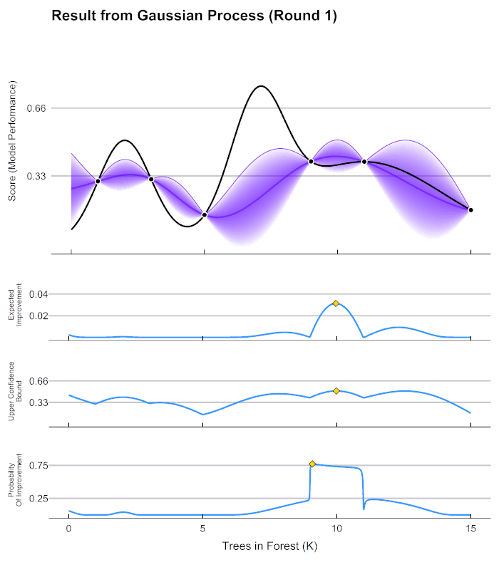

<!-- README.md is generated from README.Rmd. Please edit that file -->

[](https://travis-ci.org/AnotherSamWilson/ParBayesianOptimization)
[](https://CRAN.R-project.org/package=ParBayesianOptimization)
[](https://CRAN.R-project.org/package=ParBayesianOptimization)
[](https://CRAN.R-project.org/package=ParBayesianOptimization)
[](https://codecov.io/gh/AnotherSamWilson/ParBayesianOptimization/branch/master)

# Parallelizable Bayesian Optimization


This README contains a thorough walkthrough of Bayesian optimization and
the syntax needed to use this package, with simple and complex examples.
More information can be found in the package vignettes and manual.

## Table of Contents

  - [01 -
    Installation](https://github.com/AnotherSamWilson/ParBayesianOptimization#Installation)  
  - [02 - Package
    Process](https://github.com/AnotherSamWilson/ParBayesianOptimization#Package-Process)  
  - [03 - Bayesian Optimization
    Intuition](https://github.com/AnotherSamWilson/ParBayesianOptimization#Bayesian-Optimization-Intuition)  
  - [04 - Simple
    Example](https://github.com/AnotherSamWilson/ParBayesianOptimization#Simple-Example)  
  - [05 - Hyperparameter
    Tuning](https://github.com/AnotherSamWilson/ParBayesianOptimization#Hyperparameter-Tuning)  
  - [06 - Running In
    Parallel](https://github.com/AnotherSamWilson/ParBayesianOptimization#Running-In-Parallel)  
  - [07 - Sampling Multiple Promising Points at
    Once](https://github.com/AnotherSamWilson/ParBayesianOptimization#Sampling-Multiple-Promising-Points-at-Once)  
  - [08 - How Long Should it Run
    For?](https://github.com/AnotherSamWilson/ParBayesianOptimization#how-long-should-it-run-for)  
  - [09 - Setting Stopping
    Criteria](https://github.com/AnotherSamWilson/ParBayesianOptimization#Setting-Time-Limits-and-Other-Halting-Criteria)

## Installation

You can install the most recent stable version of
ParBayesianOptimization from CRAN with:

``` r
install.packages("ParBayesianOptimization")
```

You can also install the most recent development version from github
using devtools:

``` r
# install.packages("devtools")
devtools::install_github("AnotherSamWilson/ParBayesianOptimization")
```

## Package Process

Machine learning projects will commonly require a user to “tune” a
model’s hyperparameters to find a good balance between bias and
variance. Several tools are available in a data scientist’s toolbox to
handle this task, the most blunt of which is a grid search. A grid
search gauges the model performance over a pre-defined set of
hyperparameters without regard for past performance. As models increase
in complexity and training time, grid searches become unwieldly.

Idealy, we would use the information from prior model evaluations to
guide us in our future parameter searches. This is precisely the idea
behind Bayesian Optimization, in which our prior response distribution
is iteratively updated based on our best guess of where the best
parameters are. The `ParBayesianOptimization` package does exactly this
in the following process:

1.  Initial parameters are scored
2.  Gaussian Process is fit/updated  
3.  Parameter is found which maximizes an acquisition function  
4.  This parameter is scored  
5.  Repeat steps 2-4 until some stopping criteria is met

<center>


</center>

## Bayesian Optimization Intuition

As an example, let’s say we are only tuning 1 hyperparameter in an
random forest model, the number of trees, within the bounds \[1,15000\].
We have initialized the process by randomly sampling the scoring
function 7 times, and get the following results:

| Trees.In.Forest | Score |
| --------------: | ----: |
|            1000 |  0.30 |
|            3000 |  0.31 |
|            5000 |  0.14 |
|            9000 |  0.40 |
|           11000 |  0.40 |
|           15000 |  0.16 |

In this example, Score can be generalized to any error metric that we
want to *maximize* (negative RMSE, AUC, etc.). *Keep in mind, Bayesian
optimization can be used to maximize* any *black box function,
hyperparameter tuning is just a common use case*. Given these scores,
how do we go about determining the best number of trees to try next? As
it turns out, Gaussian processes can give us a very good definition of
our assumption about how the Score (model performance) is distributed
over the hyperparameters. Fitting a Gaussian process to the data above,
we can see the expected value of Score across our parameter bounds, as
well as the uncertainty bands:

<center>



</center>

Before we can select our next candidate parameter to run the scoring
function on, we need to determine how we define a “good” parameter
inside this prior distribution. This is done by maximizing different
***acquisition functions*** within the Gaussian process. The acquisition
function tells is how much ***utility*** there is at a certain
unexplored space. In the chart above, the lower 3 graphs show examples
different acquisition functions.

Our expected improvement in the graph above is maximized at \~10000. If
we run our process with the new `Trees in Forest = 10000`, we can update
our Gaussian process for a new prediction about which would be best to
sample next.

The utility functions that are maximized in this package are defined as
follows:

<center>


</center>

## Simple Example

In this example, we are optimizing a simple function with 1 input and 1
output. We, the user, need to define the function that we want to
optimize. This function should return, at a minimum, a list with a Score
element. You can also return other elements that you want to keep track
of in each run of the scoring function, which we show in the section
[Hyperparameter
Tuning](https://github.com/AnotherSamWilson/ParBayesianOptimization#Hyperparameter-Tuning).

``` r
simpleFunction <- function(x) dnorm(x,3,2)*1.5 + dnorm(x,7,1) + dnorm(x,10,2)

# Find the x that maximizes our simpleFunction
xmax <- optim(8,simpleFunction,method = "L-BFGS-B",lower = 0, upper = 15,control = list(fnscale = -1))$par

# Get a visual
library(ggplot2)
ggplot(data = data.frame(x=c(0,15)),aes(x=x)) + 
  stat_function(fun = simpleFunction) +
  geom_vline(xintercept = xmax,linetype="dashed") +
  ggtitle("simpleFunction") +
  theme_bw()
```

<!-- -->

We can see that this function is maximized around x\~7.023. We can use
`bayesOpt` to find the global maximum of this function. We just need to
define the bounds, and the initial parameters we want to sample:

``` r
bounds <- list(x=c(0,15))
initGrid <- data.frame(x=c(0,5,10))
```

Here, we run `bayesOpt`. The function begins by running `simpleFunction`
3 times, and then fits a Gaussian process to the results in a process
called [Kriging](https://en.wikipedia.org/wiki/Kriging). We then
calculate the `x` which maximizes our expected improvement, and run
`simpleFunction` at this x. We then go through 1 more iteration of this:

``` r
library(ParBayesianOptimization)

FUN <- function(x) list(Score = simpleFunction(x))

set.seed(6)
optObjSimp <- bayesOpt(
  FUN = FUN
  , bounds = bounds
  , initGrid = initGrid
  , iters.n = 2
)
```

Let’s see how close the algorithm got to the global maximum:

``` r
getBestPars(optObjSimp)
#> $x
#> [1] 6.718184
```

The process is getting pretty close\! We were only about 3% shy of the
global optimum:

``` r
simpleFunction(getBestPars(optObjSimp)$x)/simpleFunction(7.023)
#> [1] 0.968611
```

Let’s run the process for a little longer:

``` r
optObjSimp <- addIterations(optObjSimp,iters.n=3,verbose=0)
simpleFunction(getBestPars(optObjSimp)$x)/simpleFunction(7.023)
#> [1] 0.9958626
```

We have now found an `x` very close to the global optimum.

## Hyperparameter Tuning

In this example, we will be using the agaricus.train dataset provided in
the XGBoost package. Here, we load the packages, data, and create a
folds object to be used in the scoring function.

``` r
library("xgboost")

data(agaricus.train, package = "xgboost")

Folds <- list(
    Fold1 = as.integer(seq(1,nrow(agaricus.train$data),by = 3))
  , Fold2 = as.integer(seq(2,nrow(agaricus.train$data),by = 3))
  , Fold3 = as.integer(seq(3,nrow(agaricus.train$data),by = 3))
)
```

Now we need to define the scoring function. This function should, at a
minimum, return a list with a `Score` element, which is the model
evaluation metric we want to maximize. We can also retain other pieces
of information created by the scoring function by including them as
named elements of the returned list. In this case, we want to retain the
optimal number of rounds determined by the `xgb.cv`:

``` r
scoringFunction <- function(max_depth, min_child_weight, subsample) {

  dtrain <- xgb.DMatrix(agaricus.train$data,label = agaricus.train$label)
  
  Pars <- list( 
      booster = "gbtree"
    , eta = 0.001
    , max_depth = max_depth
    , min_child_weight = min_child_weight
    , subsample = subsample
    , objective = "binary:logistic"
    , eval_metric = "auc"
  )

  xgbcv <- xgb.cv(
      params = Pars
    , data = dtrain
    , nround = 100
    , folds = Folds
    , early_stopping_rounds = 5
    , maximize = TRUE
    , verbose = 0
  )

  return(list(Score = max(xgbcv$evaluation_log$test_auc_mean)
             , nrounds = xgbcv$best_iteration
             )
         )
}
```

We also need to tell our process the bounds it is allowed to search
within:

``` r
bounds <- list( 
    max_depth = c(1L, 5L)
  , min_child_weight = c(0, 25)
  , subsample = c(0.25, 1)
)
```

We are now ready to put this all into the `bayesOpt` function.

``` r
set.seed(0)

tNoPar <- system.time(
  optObj <- bayesOpt(
      FUN = scoringFunction
    , bounds = bounds
    , initPoints = 4
    , iters.n = 4
    , iters.k = 1
  )
)
```

The console informs us that the process initialized by running
`scoringFunction` 4 times. It then fit a Gaussian process to the
parameter-score pairs, found the global optimum of the acquisition
function, and ran `scoringFunction` again. This process continued until
we had 6 parameter-score pairs. You can interrogate the `optObj` object
to see the results:

``` r
optObj$scoreSummary
#>    Epoch Iteration max_depth min_child_weight subsample gpUtility acqOptimum inBounds Elapsed     Score nrounds errorMessage
#> 1:     0         1         2         1.670129 0.7880670        NA      FALSE     TRUE    0.06 0.9777163       2           NA
#> 2:     0         2         2        14.913213 0.8763154        NA      FALSE     TRUE    0.16 0.9763760      15           NA
#> 3:     0         3         4        18.833690 0.3403900        NA      FALSE     TRUE    0.22 0.9931657      18           NA
#> 4:     0         4         4         8.639925 0.5499186        NA      FALSE     TRUE    0.14 0.9981437       7           NA
#> 5:     1         5         4        21.871937 1.0000000 0.5857961       TRUE     TRUE    0.06 0.9945933       1           NA
#> 6:     2         6         4         0.000000 0.9439879 0.6668303       TRUE     TRUE    0.13 0.9990567       7           NA
#> 7:     3         7         5         1.395119 0.7071802 0.2973497       TRUE     TRUE    0.11 0.9984577       4           NA
#> 8:     4         8         5         0.000000 0.2500000 0.3221660       TRUE     TRUE    0.17 0.9994020      10           NA
```

``` r
getBestPars(optObj)
#> $max_depth
#> [1] 5
#> 
#> $min_child_weight
#> [1] 0
#> 
#> $subsample
#> [1] 0.25
```

## Running In Parallel

The process that the package uses to run in parallel is explained above.
Actually setting the process up to run in parallel is relatively simple,
we just need to take two extra steps. We need to load any packages and
objects required by `FUN` into the back ends, after registering our
cluster:

``` r
library(doParallel)
cl <- makeCluster(2)
registerDoParallel(cl)
clusterExport(cl,c('Folds','agaricus.train'))
clusterEvalQ(cl,expr= {
  library(xgboost)
})
```

We can now run our process in paralel\! Make sure you set iters.k to
some sensible value to take advantage of the parallelization setup.
Since we have registered 2 cores, we set `iters.k` to 2:

``` r
tWithPar <- system.time(
  optObj <- bayesOpt(
      FUN = scoringFunction
    , bounds = bounds
    , initPoints = 4
    , iters.n = 4
    , iters.k = 2
    , parallel = TRUE
  )
)
stopCluster(cl)
registerDoSEQ()
```

We managed to massively cut the process time by running the process on 2
cores in parallel. However, keep in mind we only performed 2
optimization steps, versus the 4 performed in the sequential example:

``` r
tWithPar
#>    user  system elapsed 
#>    0.98    0.04    7.55
tNoPar
#>    user  system elapsed 
#>   23.44    1.25   22.47
```

## Sampling Multiple Promising Points at Once

Sometimes we may want to sample multiple promising points at the same
optimization step (Epoch). This is especially effective if the process
is being run in parallel. The `bayesOpt` function always samples the
global optimum of the acquisition function, however it is also possible
to tell it to sample local optimums of the acquisition function at the
same time.

Using the `acqThresh` parameter, you can specify the minimum percentage
utility of the global optimum required for a different local optimum to
be considered. As an example, let’s say we are optimizing 1 input `x`,
which is bounded between \[0,1\]. Our acquisition function may look like
the following:


In this case, there are 3 promising candidate parameters: x \~
\[0.318,0.541,0.782\] with corresponding upper confidence bounds of y \~
\[1.195,1.304,1.029\], respectively. We may want to run our scoring
function on several of the local maximums. If `acqThresh` is set to be
below 1.029/1.304 \~ 0.789 and `iters.k` is set to at least 3, the
process would use all 3 of the local maximums as candidate parameter
sets in the next round of scoring function runs.

## How Long Should it Run For?

Going back to the example in [Simple
Example](https://github.com/AnotherSamWilson/ParBayesianOptimization#Simple-Example),
(if you let this run for a few more iterations and set `plotProgress =
TRUE`) you will notice this chart is updated at each iteration:

``` r
optObjSimp <- addIterations(optObjSimp,2,verbose=FALSE)
plot(optObjSimp)
```


As you thoroughly explore the parameter space, you reduce the
uncertainty in the unexplored areas. As you reduce uncertainty, you tend
to reduce utility, which can be thought of as the potential to find a
better parameter set than the one you already have. Notice that the
expected improvement converged to 0 after iteration 5. If you see a
similar pattern, you can be fairly certain that you have found an
(approximately) global optimum.

## Setting Time Limits and Other Halting Criteria

Many times the scoring function can vary in its completion time. It may
be difficult for the user to forecast how long a single run will take,
let alone X sequential runs. For this reason, you can set a time limit.
You can also set a minimum utility limit, or you can set *both*, in
which case the process stops when either condition is met. You can see
how the process stopped by viewing the `stopStatus` element in the
returned object:

``` r
set.seed(0)

tNoPar <- system.time(
  optObj <- bayesOpt(
      FUN = scoringFunction
    , bounds = bounds
    , initPoints = 4
    , iters.n = 400
    , iters.k = 1
    , otherHalting = list(timeLimit = 5)
  )
)

optObj$stopStatus
#> [1] "Time Limit - 5 seconds."
#> attr(,"class")
#> [1] "stopEarlyMsg"
```
