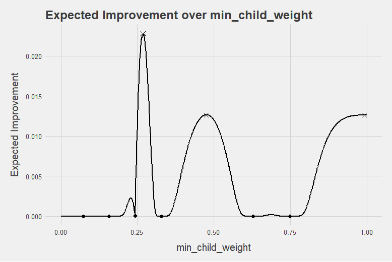
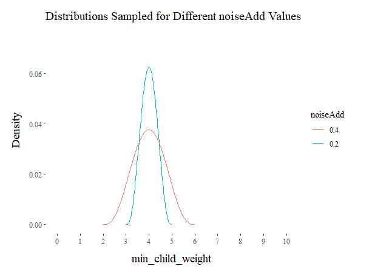

```{r setup, include=FALSE}
knitr::opts_chunk$set(echo = TRUE)
options(width = 1000)
```

### Running in Parallel

Fortunately, the most time intensive part of our parameter search (running the scoring function) can easily be done in parallel. ```PayBayesianOptimization``` creates a flexible framework for setting up your parameter search as efficiently as possible. The steps are similar to a vanilla implementation of BayesianOptimization as seen in the first vignette, we just need to load a package that allows us to register a parallel backend and define a few extra variables. On a Windows machine, you can use ```doParallel```:

```{r eval = TRUE, results='hide', echo=TRUE, message=FALSE}
library("xgboost")
library("ParBayesianOptimization")
library("doParallel")

data(agaricus.train, package = "xgboost")

Folds <- list(Fold1 = as.integer(seq(1,nrow(agaricus.train$data),by = 3))
            , Fold2 = as.integer(seq(2,nrow(agaricus.train$data),by = 3))
            , Fold3 = as.integer(seq(3,nrow(agaricus.train$data),by = 3)))

scoringFunction <- function(max_depth, min_child_weight, subsample) {

  dtrain <- xgb.DMatrix(agaricus.train$data,label = agaricus.train$label)
  
  Pars <- list( booster = "gbtree"
              , eta = 0.01
              , max_depth = max_depth
              , min_child_weight = min_child_weight
              , subsample = subsample
              , objective = "binary:logistic"
              , eval_metric = "auc")

  xgbcv <- xgb.cv(params = Pars
                , data = dtrain
                , nround = 100
                , folds = Folds
                , prediction = TRUE
                , showsd = TRUE
                , early_stopping_rounds = 5
                , maximize = TRUE
                , verbose = 0)

  return(list(Score = max(xgbcv$evaluation_log$test_auc_mean)
            , nrounds = xgbcv$best_iteration
             )
         )
}

bounds <- list( max_depth = c(2L, 10L)
              , min_child_weight = c(1, 100)
              , subsample = c(0.25, 1))

kern <- "Matern52"

acq <- "ei"
```

From here, we need to define two important function parameters, ```export``` and ```packages```. These tell the foreach loop which packages/variables need to be loaded into each parallel instance:

```{r eval = TRUE, results='hide', echo=TRUE}
packages <- 'xgboost'

export <- c('Folds','agaricus.train')
```

We are now ready to start our parameter search. If you want to make full use of your core cluster, bulkNew should be set to be the same as the number of registered cores. Once again, we can interrogate ```ScoreResults$BestPar``` to see the best parameters as of each iteration:

```{r eval = TRUE, echo=TRUE}
cl <- makeCluster(2)
registerDoParallel(cl)
ScoreResult <- BayesianOptimization(FUN = scoringFunction
                                  , bounds = bounds
                                  , initPoints = 10
                                  , bulkNew = 2
                                  , nIters = 14
                                  , kern = kern
                                  , acq = acq
                                  , verbose = 1
                                  , parallel = TRUE
                                  , packages = packages
                                  , export = export
                                  , noiseAdd = 0.25)
```
*******
### Re-using Intermediary Results in Later Experiment

Unfortunately, our experiments do not always give us the results we want. Maybe we didn't let it run long enough, or maybe we used the wrong kernel. It could be very time intensive and aggravating to re-initialize the process. Fortunately, the ```BayesianOptimization``` function allows us to, at every update, save our parameter-score pairs as an RDS and re-use them as our initial set in the future. This ensures that the time intensive process of running the scoring function is not wasted.  

All we need to do is specify the path/filename in the ```saveIntermediary``` parameter (this code is not meant to be run):
```{r eval = FALSE, results='hide', echo=TRUE}
ScoreResults <- BayesianOptimization(
      FUN = scoringFunction
    , bounds = bounds
    ...
    , saveIntermediary = "../Intermediary Results/Experiment1.RDS"
    ...
  )
```

If a file currently exists, it **WILL** be overwritten. After this process has run, this file can be recalled and passed to the ```BayesianOptimization``` function in the ```leftoff``` parameter:  
```{r eval = FALSE, results='hide', echo=TRUE}

priorRuns <- readRDS("../Intermediary Results/Experiment1.RDS") 

ScoreResults <- BayesianOptimization(
      FUN = scoringFunction
    , bounds = bounds
    ...
    , saveIntermediary = "../Intermediary Results/Experiment2.RDS"
    , leftOff = priorRuns
    ...
  )
```

When a leftOff table is provided, depending on how the experiment is set up, one of two things will happen:  

  1. If ```initialize``` is TRUE, the process will initialize normally and append the leftOff table when it fits Gaussian Process'  
  2. If ```initialize``` is FALSE, the process will treat leftOff as the only initial parameter-score pairs. We can start fitting our priors without having to run the scoring function at all!  
  
Keep in mind, if you change your bounds, you will need to delete any rows from your leftOff table that fall outside the bounds.

********
### Adjusting noiseAdd and minClusterUtility

If we want to run n scoring functions in parallel, an important decision we need to make is how to choose the next n parameter candidate sets. One logical choice is the parameter set which maximizes our acquisition function. However, we still need to decide on the other n-1 sets. There are two good choices:

  1. Add noise to the global optimum to sample nearby points.
  2. Determine if there are other local optimums which may be nearly as good
  
This package allows you to do both. Using the ```minClusterUtility``` parameter, you can specify the minimum percentage utility of the global optimum required for a different local optimum to be considered. As an example, let's say we are optimizing 1 hyperparameter ```min_child_weight```, which is bounded between [0,1]. Our acquisition function may look like the following:

```{r eval = TRUE, echo=FALSE}

```

In this case, there are 3 promising candidate parameters. We may want to run our scoring function on several of the local maximums. If ```minClusterUtility``` is set to be below 0.0126/0.0228 ~ 0.55, the process would use all 3 of the local maximums as candidate parameter sets in the next round or scoring function runs.

However, this doesn't fully solve our problem. In the example above, we had 2 local maximums, but what if we want to run 10 instances of our scoring function in parallel? We would need to come up with 8 other sets of parameters. For the sake of decreasing uncertainty around the most promising parameter sets, this process samples from a shape(4,4) beta distribution centered at the estimated optimal parameters. In the example above, our acquisition function was maximized at ```min_child_weight = 4```. The figure below shows the effect that adjusting the ```noiseAdd``` parameter has on how we draw the other 8 candidate parameter sets:

```{r eval = TRUE, echo=FALSE}

```


