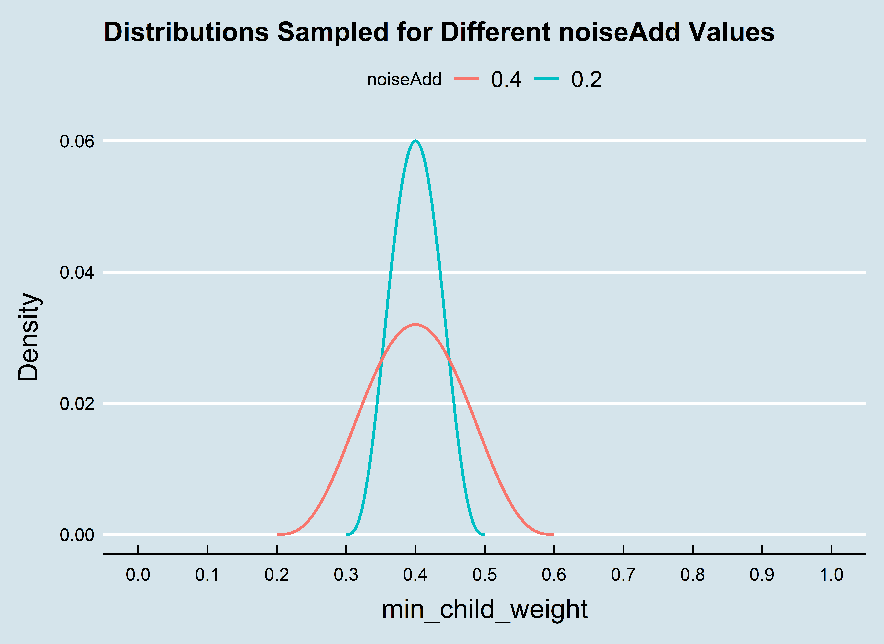

```{r setup, include=FALSE}
knitr::opts_chunk$set(echo = TRUE)
options(width = 1000)
set.seed(1991)
```

### Sampling Local Optimums

Sometimes we may want to sample multiple promising parameter sets at the same time. This is especially effective if the process is being run in parallel. The ```BayesianOptimization``` function always samples the global optimum of the acquisition function, however it is also possible to tell it to sample local optimums of the acquisition function at the same time.
  
Using the ```minClusterUtility``` parameter, you can specify the minimum percentage utility of the global optimum required for a different local optimum to be considered. As an example, let's say we are optimizing 1 hyperparameter ```min_child_weight```, which is bounded between [0,5]. Our acquisition function may look like the following:

```{r, eval = TRUE, echo=FALSE, out.width = "600px", fig.align = "center"}
knitr::include_graphics("UCB.png")
```

In this case, there are 3 promising candidate parameters. We may want to run our scoring function on several of the local maximums. If ```minClusterUtility``` is set to be below ~0.95, and ```bulkNew``` is set to at least 3, the process would use all 3 of the local maximums as candidate parameter sets in the next round of scoring function runs.

### Adding Noise to Obtain Parameter Sets

However, this doesn't fully solve our problem. In the example above, we had 2 local maximums, but what if we want to run 10 instances of our scoring function in parallel? What if there were no local optimums of the acquisition function besides the global optimum? We would need to come up with more sets of parameters. 

For the sake of decreasing uncertainty around the most promising parameter sets, this process samples from a shape(4,4) beta distribution centered at the estimated optimal parameters. In the example above, our acquisition function was maximized at ```min_child_weight = 4```. The figure below shows the effect that adjusting the ```noiseAdd``` parameter has on how we draw the other 8 candidate parameter sets:

```{r eval = TRUE, echo=FALSE, out.width = "600px", fig.align = "center"}

```


